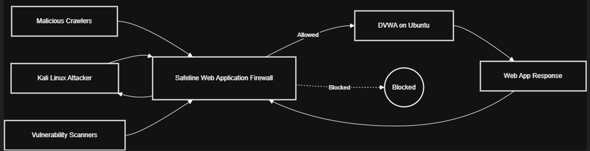

# DamnVulnWebApp-Protection-With-Safeline-WebAppFirewall
End-to-end web security project deploying SafeLine WAF to protect DVWA, simulating attacks from Kali Linux, monitoring WAF alerts, and creating tailored rules to block malicious traffic and enhance application defense.

**Author:** Uzair Khan

## Overview  

This project walks you through using SafeLine WAF to secure a vulnerable web app, DVWA (Damn Vulnerable Web Application). The goal is to simulate real-world cyberattacks, monitor how SafeLine WAF responds, and tweak its settings to block malicious traffic and better protect the app.

## Tech Stack:  

**SafeLine WAF**: Web Application Firewall for filtering and monitoring HTTP traffic.    
**DVWA (Damn Vulnerable Web Application)**: A deliberately insecure web app used for security testing and learning.    
**Kali Linux**: Penetration testing platform used to simulate attacks and exploit vulnerabilities.    

🚧 _**Work in Progress**_

